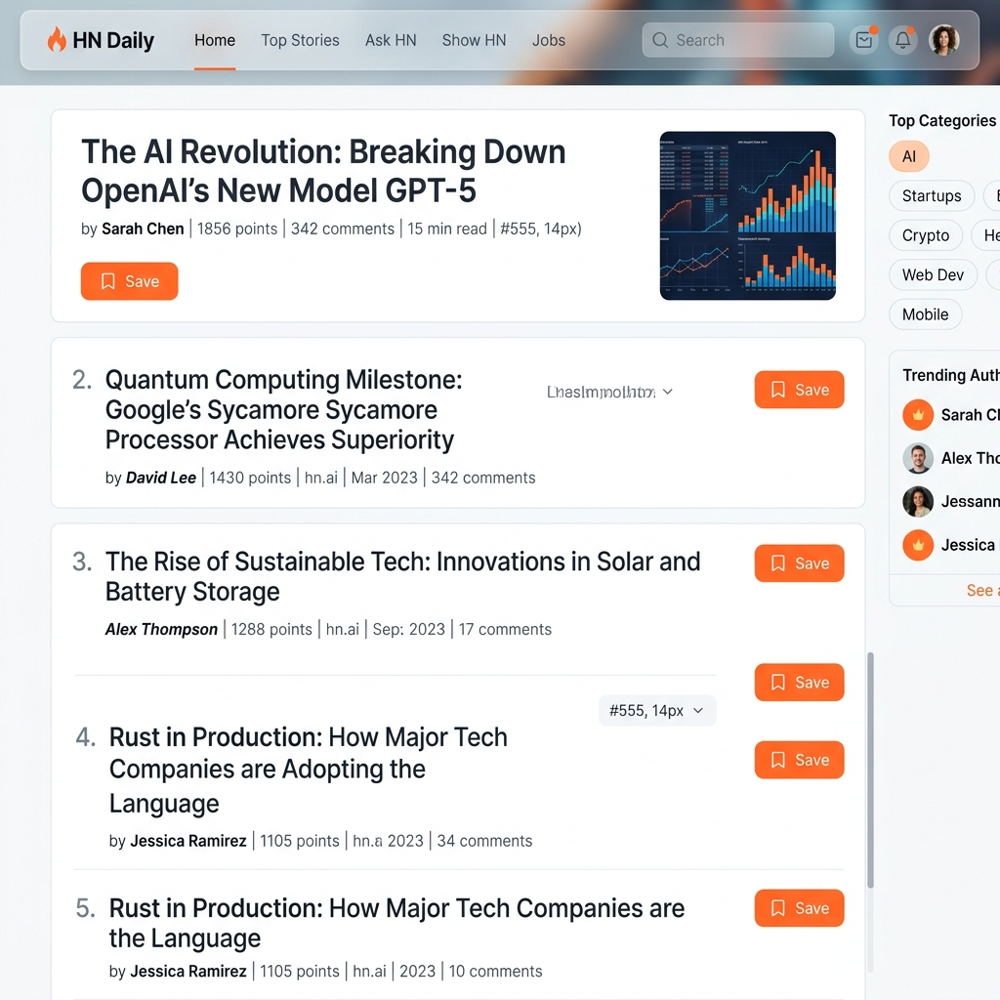

# HN Scraper - Full Stack MERN Application

A premium full-stack web application that scrapes the top 10 stories from Hacker News, provides user authentication, and allows bookmarking of favourite stories.

## 📸 Screenshots

### 🖥️ Dashboard (Light Theme)


### 🔐 Authentication


## Features

- **Hacker News Scraper**: Automatically fetches the top 10 stories on server start.
- **RESTful API**: Custom endpoints for stories, authentication, and manual scraping.
- **Authentication**: Secure JWT-based registration and login system.
- **Bookmarking**: Users can bookmark stories; bookmarks are persisted in MongoDB.
- **Responsive UI**: A premium, dark-themed React frontend built with Vite and Vanilla CSS.
- **Pagination**: Browse through scraped stories with ease.

## Tech Stack

- **Frontend**: React.js (Vite), Axios, React Router, Context API
- **Backend**: Node.js, Express.js, Cheerio (for scraping), JWT (for auth)
- **Database**: MongoDB

## Prerequisites

- Node.js (v16+)
- MongoDB (Local or Atlas)

## Setup Instructions

### 1. Clone the repository
```bash
git clone <your-repo-url>
cd hn-scraper
```

### 2. Backend Setup
1. Navigate to the backend folder:
   ```bash
   cd backend
   ```
2. Install dependencies:
   ```bash
   npm install
   ```
3. Create a `.env` file in the `backend` directory and add the following variables:
   ```env
   PORT=5000
   MONGO_URI=mongodb://localhost:27017/hn-scraper
   JWT_SECRET=your_super_secret_jwt_key
   JWT_EXPIRE=7d
   NODE_ENV=development
   ```
4. Start the backend server:
   ```bash
   npm run dev
   ```

### 3. Frontend Setup
1. Navigate to the frontend folder:
   ```bash
   cd ../frontend
   ```
2. Install dependencies:
   ```bash
   npm install
   ```
3. Create a `.env` file in the `frontend` directory:
   ```env
   VITE_API_URL=http://localhost:5000/api
   ```
4. Start the frontend development server:
   ```bash
   npm run dev
   ```

## API Endpoints

### Auth
- `POST /api/auth/register` - Register a new user
  - Body: `{ "username": "...", "email": "...", "password": "..." }`
- `POST /api/auth/login` - Login user
  - Body: `{ "email": "...", "password": "..." }`
- `GET /api/auth/me` - Get current user profile (Auth Required)

### Stories
- `GET /api/stories` - Fetch all stories
  - Query: `?page=1&limit=10`
  - Response: `{ "success": true, "data": [...], "pagination": {...} }`
- `GET /api/stories/:id` - Fetch a single story by ID
- `POST /api/stories/:id/bookmark` - Toggle bookmark (Auth Required)

### Scraper
- `POST /api/scrape` - Manually trigger the scraper

## Folder Structure
```
hn-scraper/
├── backend/
│   ├── config/         # DB connection
│   ├── controllers/    # API logic
│   ├── middleware/     # Auth protection
│   ├── models/         # Mongoose schemas
│   ├── routes/         # Express routes
│   ├── services/       # Scraper logic
│   └── server.js       # Entry point
└── frontend/
    ├── src/
    │   ├── api/        # Axios client
    │   ├── components/ # Reusable UI
    │   ├── context/    # State management
    │   ├── pages/      # View components
    │   └── App.jsx     # Main routing
```

## 🌟 Bonus Features Implemented

- [x] **Advanced Pagination**: Fully functional `page` and `limit` support on both API and Frontend.
- [x] **Premium UI**: Modern light-theme design with high-end typography and micro-interactions.
- [x] **On-Demand Scraping**: Interactive UI trigger to refresh stories from Hacker News.
